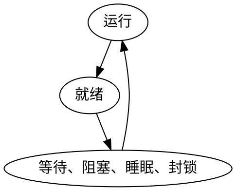

# 进程

## 基础
进程：程序的**一次**执行过程。
系统资源(如内存、文件等)以进程为单位分配，每个进程具有独立的地址空间
在一个时间点，cpu只能调度给一个进程。

PCB：process control block
进程控制块，进程描述符，进程属性
这是一个数据结构，来记录某个进程的各种属性

所有PCB的集合：进程表
进程表的大小是固定的，操作系统地并发度（最多能并发执行多少个进程）

PCB包括四大方面变量：描述，控制，资源，CPU
1. 进程描述信息：pid(整数)，进程名，user id，进程组(父子)关系
2. 进程控制信息：状态、优先级。。。
3. 所拥有的资源和使用情况：虚拟地址空间状况，打开文件列表
4. CPU现场信息（进程不运行时记录）：寄存器值，指向该进程**页表**的指针
另一种分类方法：process, memory, file

linux中的PCB:
```c++
struct task_struct {
    pid_t pid;
    unsigned_long flags;
    struct list_head run_list;
    ...
}
```

进程表例子：
... <-> PCB1 <-> PCB2 <-> PCB3 <-> ... 
其中一个PCB中可能包含以下内容：
p_exec: 可执行文件（查询可执行的文件）
p_ss: 地址空间（'段'的AVL树）
u_finfo: 打开的文件（一个表）
...

## 进程状态
运行，就绪，等待/阻塞/睡眠/封锁
running, ready(等待cpu), waiting/blocked(等待读盘结果)

状态转换


创建，终止
new, terminated


五状态进程模型


每一类状态建立一个队列，队列元素为PCB
状态改变：PCB从一个队列进入另外一个队列
单CPU中，运行的进程只有一个，所以运行的PCB队列中只有一个元素

## 进程控制
进程控制操作：完成进程状态间的转换
进程控制操作实际上就是具有特定功能（完成进程状态间的转换）的程序，这些程序不能被中断，叫做原语。

1. 进程的创建（fork, exec）
分配pid，分配地址空间，初始化PCB，把新程序加入到就绪队列链表中
2. 结束进程 (exit)
回收资源（关闭打开的文件，回收分配的内存，断开网络连接）
撤销PCB
3. 阻塞（wait）
处于运行状态的进程，在其运行过程中，会等待某个事件的发生（键盘的输入，等待磁盘的数据传输，等待其他进程给它发来一些消息）在这些事件没有发生的情况下，那么进程需要自己执行一个阻塞原语，使自己的状态由运行态变为阻塞态


* fork 实际上是创建新的进程，通过复制调用进程本身来创建的，那么调用进程我们称之为父进程，也就是通过复制父进程，来创建子进程, 这是一个非常基本的进程建立过程
* exec 这是一个系列的系统调用, 它的主要目的是, 通过用一段新的程序, 来覆盖原来的地址空间，也就是 父进程，原来是把自己的所有内容 复制给子进程，那么子进程呢，用一些新的代码 程序代码，把父进程拷贝过来的内容，给它覆盖掉 通过这样一个覆盖，实现了进程的执行代码的一个转换
* wait 一个初级的一个同步操作 它能使得一个进程等待另外一个进程的结束
* exit 用来终止一个进程的运行